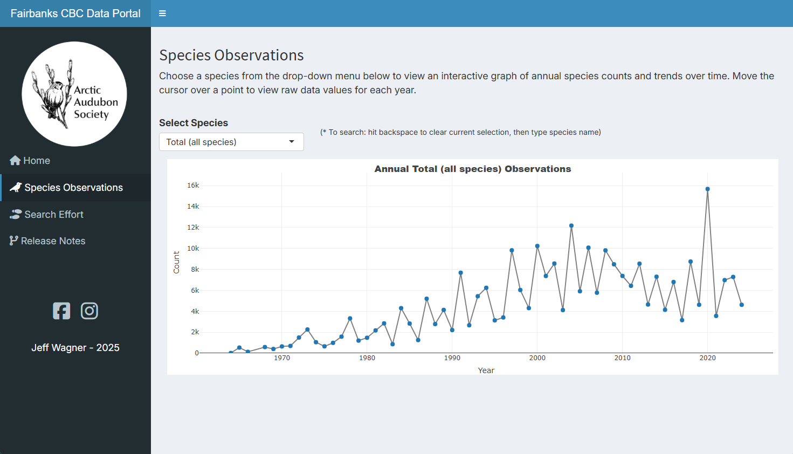

The <i> Fairbanks CBC Data Portal</i> is an app that let you visualize the Arctic Audubon Society's <a href="https://www.arcticaudubon.org/christmas-bird-count-1" target="_blank"> Annual Fairbanks Christmas Bird Count</a>. The Fairbanks Christmas Bird Count is part of the Annual Christmas Bird Count, a nation-wide winter tradition organized by the National Audubon Society throughout the American hemisphere.

**Links**

* **App:** [https://jeff-wagner.shinyapps.io/ArcticAudubonCBC/](https://jeff-wagner.shinyapps.io/ArcticAudubonCBC/)
* **Github:** [https://github.com/jeff-wagner/fairbanksCBC/ ](https://github.com/jeff-wagner/fairbanksCBC/)

 

**Features**

* Users can explore species observations and search effort measures by year from 1964-present
* The application layout is made with [**shinydashboard**](https://rstudio.github.io/shinydashboard/)

**Planned Updates**

* Interactive yearly summary page to display number of species observed and summarize search effort metrics
* Incorporation of spatial observation data (for available years) to display counts and trends by search area
* Integration with the [google analytics.js library](https://shiny.rstudio.com/articles/google-analytics.html), to measure how users interact with the app

**Acknowledgements**

* Special thanks to Alessio Benedetti and her [*Biodiversity in National Parks*](https://github.com/abenedetti/bioNPS/) app, from which I drew much inspiration. 

 This work is licensed under a <a rel="license" href="http://creativecommons.org/licenses/by-nc-sa/4.0/">Creative Commons Attribution-NonCommercial-ShareAlike 4.0 International License.</a>